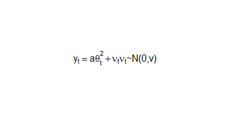
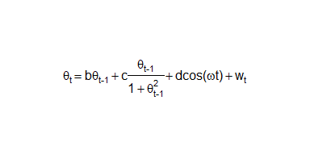
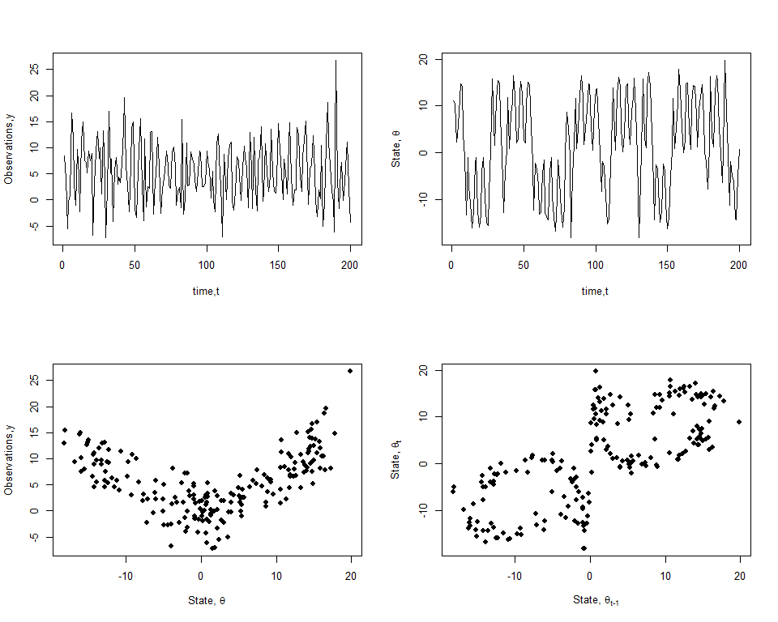
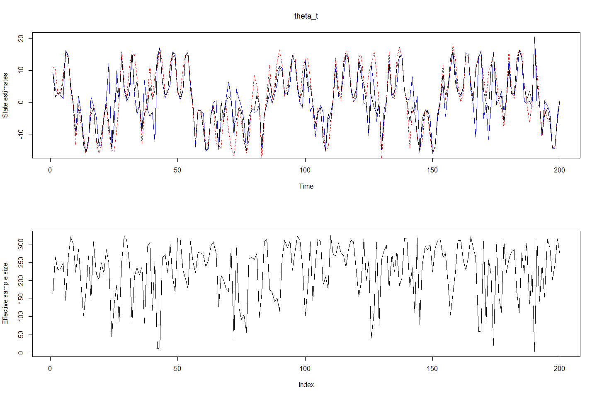
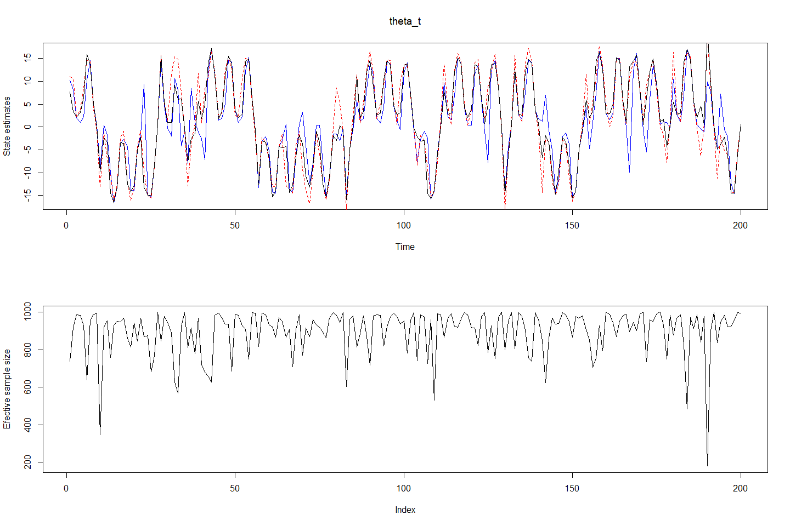
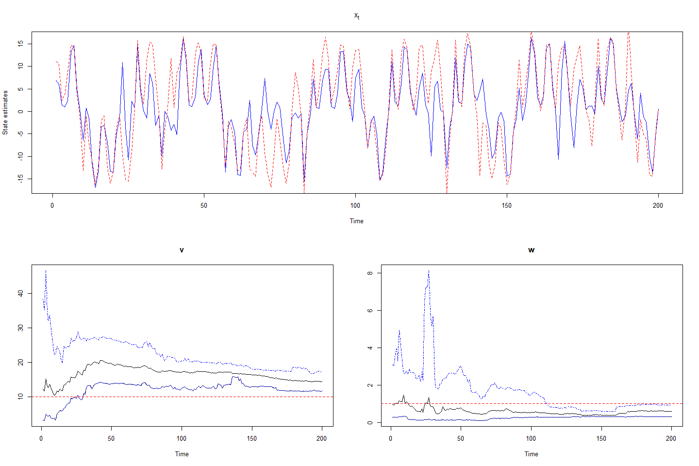
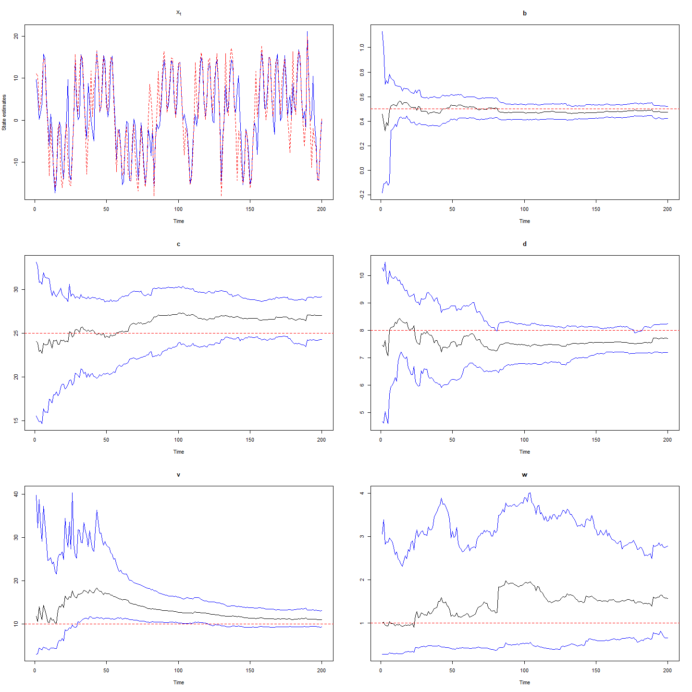

Posterior Simulation: Sequential Monte Carlo
================

## Nonlinear time series model

The following nonlinear time series model is analyzed.

<!-- --><!-- -->

The function is used to generate \(y_t\) and \(\theta_t\) for
\(t=1:200\) and with particular values of the parameters
\((a=\frac{1}{20},b=\frac{1}{2},c=25,d=8,\omega=1.2,v=10\textrm{ and }w=1)\).

``` r
a = 1/20
b = 1/2
c = 25
d = 8
beta <- c(b,c,d)
omega = 1.2
v = 10
w = 1
Tbig = 200

G <- function(arg){c(arg[1],arg[1]/(1+arg[1]^2),cos(omega*arg[2]))}

# Simulating the data
set.seed(12345)
sim.y         <- rep(0,Tbig)
sim.theta     <- rep(0,Tbig)
sim.theta0    <- 0.1
sim.t0        <- 0.0

g             <- G(c(sim.theta0,sim.t0))
sim.theta[1]  <- rnorm(1,sum(g*beta),sqrt(w))
sim.y[1]      <- rnorm(1,a*sim.theta[1]^2,sqrt(v))
for(t in 2:Tbig)
{
  g            <- G(c(sim.theta[t-1],t-1))
  sim.theta[t] <- rnorm(1,sum(g*beta),sqrt(w))
  sim.y[t]     <- rnorm(1,a*sim.theta[t]^2,sqrt(v))
}

# Plot the time series
par(mfrow=c(2,2))
plot(sim.y,type="l",xlab="time,t",ylab="Observations,y")
plot(sim.theta,type="l",xlab="time,t",ylab=TeX("State,$\\theta$"))

plot(sim.theta,sim.y,type="p",pch=19,xlab=TeX("State,$\\theta$"),ylab="Observations,y")
plot(sim.theta[1:199],sim.theta[2:200],type="p",pch=19,xlab=TeX("State,$\\theta_{t-1}$"),
     ylab=TeX("State,$\\theta_{t}$"))
```

<!-- -->

``` r
# Evaluate 2.5% and 97.5 % quantiles
quant025    <- function(x){quantile(x,0.025)}
quant975    <- function(x){quantile(x,0.975)}


# Smoothing function
smoothing <- function(Tbig,M,theta)
{
  theta.smooth <- array(0,dim=c(Tbig,M))
  theta.smooth[Tbig,] <- theta[Tbig,]
  for(t in (Tbig-1):1)
  {
    X <- t(apply(cbind(theta[t,],t-1),1,G))
    m.theta <- apply(X*beta,1,sum)
    wt <- dnorm(theta.smooth[t+1,],m.theta,sqrt(v))
    wt <- wt/sum(wt)
    theta.smooth[t,] <- sample(theta[t,],size=M,
                               replace=T,prob=wt)
  }
  return(theta.smooth)
}
```

## Sequential Importance Sampling with Resampling

``` r
# Sequential importance sampling with resampling (SISR)
# ------------------------------------
smc.sisr <- function(Tbig,M,y,theta0,wt0)
{
  est.theta <- NULL
  ess <- NULL
  
  theta <- theta0
  wt <- wt0
  
  for(t in 1:Tbig)
  {
    X <- t(apply(cbind(theta,t-1),1,G))
    m.theta <- apply(X*beta,1,sum)
    theta <- rnorm(M,m.theta,sqrt(w))
    
    wt <- dnorm(y[t],a*theta^2,sqrt(v))
    wt <- wt/sum(wt)
    
    # Estimated states
    est.theta <- rbind(est.theta,sample(theta,size=M,
                                        replace=T,prob=wt))
    # Estimated sample size
    ess <- rbind(ess,1/sum(wt^2))
  }
  return(list("theta"=est.theta,"ess"=ess))
}

set.seed(12545)
M <- 1000
m0 <- 0
C0 <- 100

theta0 <- rnorm(M,m0,sqrt(C0))
wt0 <- rep(1/M,M)

est <- smc.sisr(Tbig,M,sim.y,theta0,wt0)
smt <- smoothing(Tbig,M,est$theta)
sisr.stheta = apply(smt,1,mean)
sisr.mtheta = apply(est$theta,1,mean)
sisr.ltheta = apply(est$theta,1,quant025)
sisr.utheta = apply(est$theta,1,quant975)
sisr.es <- est$ess

par(mfrow=c(2,1))
plot(sisr.mtheta,xlab="Time",ylab="State estimates",
     main=expression(theta_t),type = 'l',col="blue")
lines(sim.theta,col="red",lty=2)
lines(sisr.stheta,col=1,lty=1)
plot(sisr.es,type="l",ylab="Effective sample size")
```

<!-- -->

## Auxillary Particle Filter

We now analyze the auxillary particle filter approach for posterior
simulation using sequential Monte Carlo. The first

``` r
smc.apf <- function(Tbig,M,y,theta0,wt0)
{
  # Initialize the arrays of estimates
  est.theta <- NULL
  ess <- NULL
  
  theta <- theta0
  wt <- wt0
  
  # Iterate over the time instants
  for (t in 1:Tbig)
  {
    X <- t(apply(cbind(theta,t-1),1,G))
    m.theta <- apply(X*beta,1,sum)
    theta.prior <- rnorm(M,m.theta,sqrt(w))
    wt <- dnorm(y[t],a*theta.prior^2,sqrt(v))*wt
    k <- sample(M,size=M,replace=T,prob=wt/sum(wt))
    
    theta <- rnorm(M,m.theta[k],sqrt(w))
    wt <- dnorm(y[t],a*theta^2,sqrt(v))/dnorm(y[t],
                                              a*m.theta[k]^2,sqrt(v))  
    wt <- wt/sum(wt)
    
    # Find estimated state through resampling
    est.theta <- rbind(est.theta,sample(theta, M, 
                                        replace = T, prob = wt))
    # Estimated sample size
    ess <- rbind(ess,1/sum(wt^2))
  }
  return(list("theta"=est.theta,"ess"=ess))
}


set.seed(12545)
M <- 1000
m0 <- 0
C0 <- 100

theta0 <- rnorm(M,m0,sqrt(C0))
wt0 <- rep(1/M,M)

est <- smc.apf(Tbig,M,sim.y,theta0,wt0)
smt <- smoothing(Tbig,M,est$theta)
apf.stheta = apply(smt,1,mean)
apf.mtheta = apply(est$theta,1,mean)
apf.ltheta = apply(est$theta,1,quant025)
apf.utheta = apply(est$theta,1,quant975)
apf.es <- est$ess

par(mfrow=c(2,1))
plot(apf.mtheta,xlab="Time",ylab="State estimates",
     main=expression(theta_t),type = 'l', col="blue")
lines(sim.theta,col="red",lty=2)
lines(apf.stheta,col=1,lty=1)
plot(apf.es,type="l",ylab="Efective sample size")
```

<!-- -->

## Combined state and parameter estimation

In this section, we perform the simultaneous estiation of states and
parameters. We consider two cases:

  - The first case is where the variances (v,w) are unknown while other
    parameters (a,b,c,d,omega) are known.
  - The second case is where parameters (b,c,d,v,w) are unknown and
    (a,omega) are known.

We analyze either of these scenario using the combination of kernel
smoothing with auxillary particle filter as proposed by Liu and West
(2001). In this method, the distribution of parameters given the
information at a time instant is considered to be a mixture of normal
distributions and a particle approximation to this distribution is
evaluated.

``` r
# Liu and West filter
# -------------------

# Define discount factor
# -------------------
delta   <- 0.99
h2      <- 1-((3*delta-1)/(2*delta))^2
A       <- sqrt(1-h2)

# Sample theta and phi from particle approximations
# -------------------
sample.theta.phi <- function(M,y,t,theta,phi)
{
  # Compute phi mean and phi variance
  m.phi <- apply(phi,2,mean)
  v.phi <- var(phi)
  
  # Compute prior point estimate of (theta,phi)
  # given by (mu,m)
  X <- t(apply(cbind(theta,t-1),1,G)) 
  theta.prior <- apply(X*beta,1,sum)
  phi.prior <- A*phi+(1-A)*matrix(m.phi,M,2,byrow=T)
  
  # Sample auxillary indices
  p <- dnorm(y[t],a*theta.prior^2,exp(phi.prior[,1]/2))
  k <- sample(1:M,size=M,replace=T,prob=p)
  
  # Sample theta and phi from particle approximate
  phi.post <- phi.prior[k,] + matrix(rnorm(2*M),M,2)%*%chol(h2*v.phi)
  X <- t(apply(cbind(theta[k],t-1),1,G))
  theta.post <- rnorm(M,apply(X*beta,1,sum),exp(phi.post[,2]/2))
  weight <- dnorm(y[t],a*theta.post^2,exp(phi.post[,1]/2))/
    dnorm(y[t],a*theta.prior[k]^2,exp(phi.prior[k,1]/2))
  weight <- weight/sum(weight)
  ind    = sample(1:M,size=M,replace=T,prob=weight)
  
  return(list("theta"=theta.post[ind],"phi"=phi.post[ind,]))
}


# Sequential Monte Carlo
# -------------------
smc.liuwest.var <- function(Tbig,M,y,theta0,phi0)
{
  # Initialize the arrays of estimates
  est.theta <- NULL
  est.phi <- array(0,c(M,2,Tbig))
  
  theta <- theta0
  phi <- phi0
  
  # Iterate over the time instants
  for (t in 1:Tbig)
  {
    # Sample theta and phi from particle approximate distributions
    samples <- sample.theta.phi(M,y,t,theta,phi)
    theta <- samples$theta
    phi <- samples$phi
    
    # Update output arrays
    est.theta <- rbind(est.theta,theta)
    est.phi[,,t] <- phi
  }
  mtheta = apply(est.theta,1,mean)
  ltheta = apply(est.theta,1,quant025)
  utheta = apply(est.theta,1,quant975)
  mphi  = matrix(0,Tbig,2)
  lphi  = matrix(0,Tbig,2)
  uphi  = matrix(0,Tbig,2)
  
  for (i in 1:2)
  {
    mphi[,i] = apply(exp(est.phi[,i,]),2,mean)
    lphi[,i] = apply(exp(est.phi[,i,]),2,quant025)
    uphi[,i] = apply(exp(est.phi[,i,]),2,quant975)
  }
  
  return(list("theta_mu"=mtheta,"theta_l"=ltheta,"theta_u"=utheta,
              "phi_mu"=mphi,"phi_l"=lphi,"phi_u"=uphi))
}


pars.true <- c(v,w)
set.seed(8642)
M <- 10000

# Prior hyperparameters
# ---------------------
a0  = 3
A0  = 20
b0  = 3
B0  = 2
m0  = 0
V0  = 5

# Initialize estimates
# ---------------------
phi0 <- cbind(log(1/rgamma(M,a0,A0)),log(1/rgamma(M,b0,B0)))
theta0 <- rnorm(M,m0,sqrt(V0))

# Perform estimation
# ---------------------
est <- smc.liuwest.var(200,M,sim.y,theta0,phi0)

mx <- est$theta_mu
lx <- est$theta_l
ux <- est$theta_u

mpars <- est$phi_m
lpars <- est$phi_l
upars <- est$phi_u

layout(matrix(c(1,1,2,3), 2, 2, byrow = TRUE))
plot(mx,xlab="Time",ylab="State estimates",main=expression(x[t]),type = 'l',
     col="blue")
lines(sim.theta,col="red",lty=2)
# lines(lx,col="blue",lty=2)
# lines(ux,col="blue",lty=2)
names = c("v","w")
for (i in 1:2){
  ts.plot(lpars[,i],ylim=range(lpars[,i],upars[,i]),ylab="",main=names[i])
  lines(lpars[,i],col="blue",lty=4)
  lines(mpars[,i],col=1)
  lines(upars[,i],col="blue",lty=4)
  abline(h=pars.true[i],col="red",lty=2)
}
```

<!-- -->

``` r
pars.true <- c(beta,v,w)

# Define discount factor
delta   <- 0.99
h2      <- 1-((3*delta-1)/(2*delta))^2
A       <- sqrt(1-h2)

sample.theta.phi <- function(M,y,t,theta,phi)
{
  # Compute phi mean and phi variance
  m.phi <- apply(phi,2,mean)
  v.phi <- var(phi)
  
  # Compute auxillary indices
  X <- t(apply(cbind(theta,t-1),1,G))
  theta.prior <- apply(X*phi[,1:3],1,sum)
  phi.prior <- A*phi+(1-A)*matrix(m.phi,M,5,byrow=T)
  
  # Compute auxillary indices
  p <- dnorm(y[t],a*theta.prior^2,exp(phi.prior[,4]/2))
  k <- sample(1:M,size=M,replace=T,prob=p)
  
  # Sample theta and phi
  phi.post <- phi.prior[k,] + matrix(rnorm(5*M),M,5)%*%chol(h2*v.phi)
  X <- t(apply(cbind(theta[k],t-1),1,G))
  theta.post <- rnorm(M,apply(X*phi.post[,1:3],1,sum),exp(phi.post[,5]/2))
  weight <- dnorm(y[t],a*theta.post^2,exp(phi.post[,4]/2))/
    dnorm(y[t],a*theta.prior[k]^2,exp(phi.prior[k,4]/2))
  weight <- weight/sum(weight)
  ind    = sample(1:M,size=M,replace=T,prob=weight)
  
  return(list("theta"=theta.post[ind],"phi"=phi.post[ind,]))
}


smc.liu <- function(Tbig,M,y,theta0,phi0)
{
  # Initialize the arrays of estimates
  est.theta <- NULL
  est.phi <- array(0,c(M,5,Tbig))
  
  theta <- theta0
  phi <- phi0
  
  # Iterate over the time instants
  for (t in 1:Tbig)
  {
    samples <- sample.theta.phi(M,y,t,theta,phi)
    
    theta <- samples$theta
    phi <- samples$phi
    
    # Update
    est.theta <- rbind(est.theta,theta)
    est.phi[,,t] <- phi 
  }
  mtheta = apply(est.theta,1,mean)
  ltheta = apply(est.theta,1,quant025)
  utheta = apply(est.theta,1,quant975)
  mphi  = matrix(0,Tbig,5)
  lphi  = matrix(0,Tbig,5)
  uphi  = matrix(0,Tbig,5)
  for (i in 1:3)
  {
    mphi[,i] = apply(est.phi[,i,],2,mean)
    lphi[,i] = apply(est.phi[,i,],2,quant025)
    uphi[,i] = apply(est.phi[,i,],2,quant975)
  }
  for (i in 4:5)
  {
    mphi[,i] = apply(exp(est.phi[,i,]),2,mean)
    lphi[,i] = apply(exp(est.phi[,i,]),2,quant025)
    uphi[,i] = apply(exp(est.phi[,i,]),2,quant975)
  }
  
  return(list("theta_mu"=mtheta,"theta_l"=ltheta,"theta_u"=utheta,
              "phi_mu"=mphi,"phi_l"=lphi,"phi_u"=uphi))
}

pars.true <- c(beta,v,w)

# Liu and West filter
# -------------------
set.seed(8642)
M <- 10000

# Prior hyperparameters
# ---------------------
a0  = 3
A0  = 20
b0  = 3
B0  = 2
c0  = c(0.5,25,8)
C0  = c(0.1,16,2)
m0  = 0
V0  = 5

phi0 <- cbind(rnorm(M,c0[1],sqrt(C0[1])),rnorm(M,c0[2],sqrt(C0[2])),rnorm(M,c0[3],sqrt(C0[3])),
               log(1/rgamma(M,a0,A0)),log(1/rgamma(M,b0,B0)))
theta0 <- rnorm(M,m0,sqrt(V0))


est <- smc.liu(200,M,sim.y,theta0,phi0)

mx <- est$theta_mu
lx <- est$theta_l
ux <- est$theta_u

mpars <- est$phi_m
lpars <- est$phi_l
upars <- est$phi_u

par(mfrow=c(3,2))
plot(mx,xlab="Time",ylab="State estimates",main=expression(x[t]),type = 'l',
     col="blue")
lines(sim.theta,col="red",lty=2)
# lines(lx,col="blue",lty=2)
# lines(ux,col="blue",lty=2)
names = c("b","c","d","v","w")
for (i in 1:5){
  ts.plot(lpars[,i],ylim=range(lpars[,i],upars[,i]),ylab="",main=names[i])
  lines(lpars[,i],col="blue")
  lines(mpars[,i],col=1)
  lines(upars[,i],col="blue")
  abline(h=pars.true[i],col="red",lty=2)
}
```

<!-- -->
